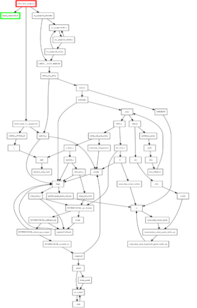
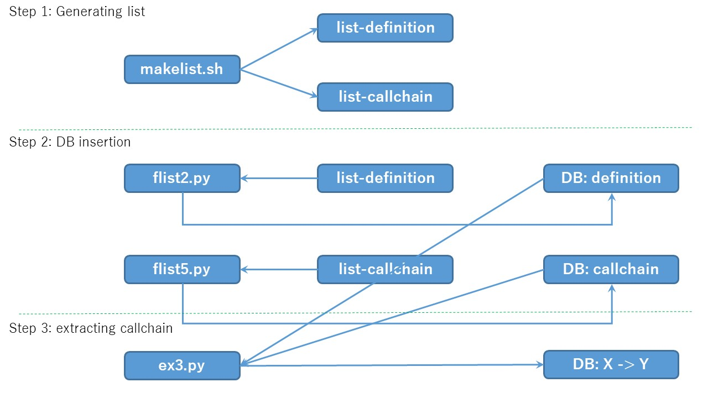

# Sample image

Simple test on RedHat of AWS.

<pre>
bash# cd mongodb
bash# ./makelist-rh-bind961.sh
bash# ./mongo-rh-bind961.sh
bash# mongo
</pre>

# Overview

# (at first) making list.

<pre>
# time ./makelist.sh
irq_resume:irq_resume();:unmodified_drivers/linux-2.6/platform-pci/machine_reboot.c:60
xen_irq_init:int xen_irq_init(struct pci_dev *pdev);:unmodified_drivers/linux-2.6/platform-pci/platform-pci.c:261
xen_irq_init:if ((ret = xen_irq_init(pdev))):unmodified_drivers/linux-2.6/platform-pci/platform-pci.c:405

real    134m16.747s
user    99m32.956s
sys     22m40.280s

# wc -l list-definition-xen412
30761 list-definition-xen412

# head -n 2 list-definition-xen412
u32_swap:static void u32_swap(void *a, void *b, int size):xen/common/sort.c:9
generic_swap:static void generic_swap(void *a, void *b, int size):xen/common/sort.c:16

# wc -l list-callchain-xen412
205593 list-callchain-xen412

# head -n 2 list-callchain-xen412
u32_swap:swap = (size == 4 ? u32_swap : generic_swap);:xen/common/sort.c:52
generic_swap:swap = (size == 4 ? u32_swap : generic_swap);:xen/common/sort.c:52

</pre>

# Measurement

makelist (step 1) on Bind-9.6.1

<pre>
dbinstance:typedef struct dbinstance dbinstance_t;typedef ISC_LIST(dbinstance_t) db_list_t;:contrib/dlz/drivers/include/dlz/sdlz_helper.h:49

real    18m39.187s
user    12m53.332s
sys     2m16.536s
</pre>

MongoDB manipulation (step 2 and 3) on Bind-9.6.1

<pre>
fn:dbinstance:loc:contrib/dlz/drivers/include/dlz/sdlz_helper.h:ln:49
x:[47, 48, 49, 50, 57, 71]
ln:49
y:2
len(x):6
lns:49
ISC_LIST

real    15m21.061s
user    1m42.336s
sys     0m9.652s
</pre>

